## 项目介绍

</img>
</img>
</img>
</img>
</img>

**AC印象** ( **ACImage**) 是一个**前后端分离的SpringCloud**论坛系统。**Web** 端使用 **Vue** + **ElementUi** 。后端使用 **SpringCloud** + **Mybatis-plus**。

**首页**

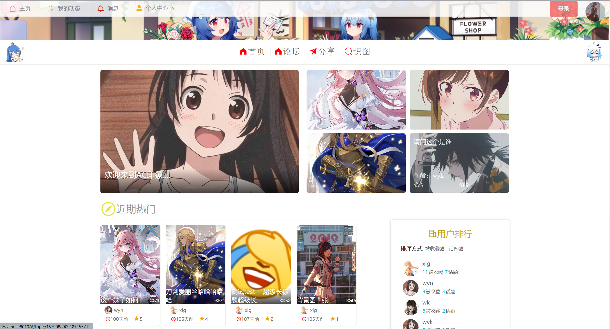</img>

## 项目功能

前台

- 酷炫的以图识图功能，即上传图片，识别出论坛内相似图片及其所在话题。
- 话题的发表、评论、收藏、排行（分别按收藏数、浏览量、活跃时间排行）
- 用户排行（分别按话题数、被收藏数排行）
- 个人动态
- 展示最新活跃话题
- 登录、注册、登出
- 已经相关的crud

`后台暂时只完成首页轮播图片的管理`

## 项目特点

- **JWT**实现单点登录
- 利用**Redis+Lua脚本+定时任务**对变动比较频繁的数据（浏览量、收藏数、评论数等）定时持久化
- 采用 **AOP** + 自定义注解 自动缓存数据到**Redis**
- 利用**Redis**实现排行榜，对变动实时更新
- 利用**Rabbitmq**同步冗余字段及异步执行一些操作
- 利用**Dhash**算法实现以图识图功能，效果还不错
- 启动时对热门数据预热

## 项目目录

后端服务

- acimage_admin: 管理系统`（尚未完善）`
- acimage_user：用户中心
- acimage_community：负责论坛主要功能
- acimage_image：负责以图识图，图片、头像等相关服务
- acimage_gateway：网关`（目前只负责转发请求）` 

后端模块

- acimage_common：公共模块，存放实体类、公共的拦截器或服务等
- acimage_feign：feign接口及相应配置和fallbackfactory

前端

- vue_acimage_admin：后台管理页面`（尚未完善）`
- vue_acimage_web：门户网站

其它

- doc: 一些文档和数据库文件

## 开发环境运行

在每个服务的**application-dev.yml**文件中

配置**mysql、redis、rabbitmq、nacos**相应的地址或账号密码

- **前台登录**：用户：wk，密码：test123456 
  （还有几个用户可以从数据库sql文件看到，密码均为 用户名123456）

## 技术选型

### 后端技术

| 技术           | 说明              | 官网                                                                                |
|:------------:|:---------------:|:---------------------------------------------------------------------------------:|
| SpringBoot   | MVC框架           | [ https://spring.io/projects/spring-boot](https://spring.io/projects/spring-boot) |
| SpringCloud  | 微服务框架           | https://spring.io/projects/spring-cloud/                                          |
| MyBatis-Plus | ORM框架           | https://mp.baomidou.com/                                                          |
| RabbitMQ     | 消息队列            | [ https://www.rabbitmq.com/](https://www.rabbitmq.com/)                           |
| Redis        | 分布式缓存           | https://redis.io/                                                                 |
| Druid        | 数据库连接池          | [ https://github.com/alibaba/druid](https://github.com/alibaba/druid)             |
| 七牛云          | 七牛云 - 对象储存      | https://developer.qiniu.com/sdk#official-sdk                                      |
| JWT          | JWT登录支持         | https://github.com/jwtk/jjwt                                                      |
| SLF4J        | 日志框架            | http://www.slf4j.org/                                                             |
| Lombok       | 简化对象封装工具        | [ https://github.com/rzwitserloot/lombok](https://github.com/rzwitserloot/lombok) |
| Nginx        | HTTP和反向代理web服务器 | http://nginx.org/                                                                 |
| Hutool       | Java工具包类库       | https://hutool.cn/docs/#/                                                         |

### 前端

| 技术                   | 说明       |
|:--------------------:|:--------:|
| vue                  | 前端框架     |
| vue-router           | 路由       |
| element-ui           | vue基础组件库 |
| axios                | http客户端  |
| jwt-decode           | 解码jwt信息  |
| jsencrypt            | 用来加密信息   |
| vue-dompurify-html   | 防xss攻击   |
| @tinymce/tinymce-vue | 富文本编辑器   |

## 未来计划

- [x] 将图片存储在七牛云中
- [x] 使用富文本编辑器编辑发表话题
- [ ] 后台管理系统
- [ ] 增加RABC权限控制
- [ ] 增加评论表情
- [ ] 前端打包下载话题图片功能
- [ ] 增加用户消息通知功能
- [ ] 增加随机推荐话题版块
- [ ] 增加话题标签
- [ ] 增加关注功能
- [ ] 增加邮件服务
- [ ] 增加elasticsearch全文搜索及日志集成
- [ ] 完善sentinel和nacos等配置和使用
- [ ] 增加爬虫模块
- [ ] 完善单元测试
- [ ] 等等等

目前完成的功能还比较少，正好适合大家二次开发（手动狗头）。还不抓紧

## 交流

项目起初是为了学习技术搭建的，由于能力有限，还有很多不完善的地方，欢迎各位能够指正。如果有人感兴趣（多么希望真的有人感兴趣 手动捂脸）或者该项目遇到什么问题或有什么建议，可加qq 1179836161 交流联系，备注：acimage。

## 网站截图

 **Web端** 
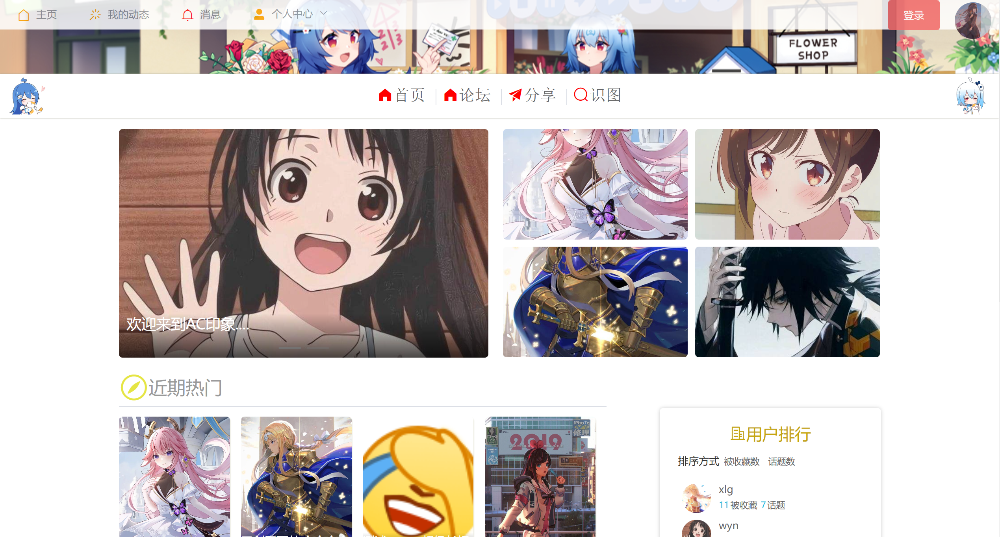             
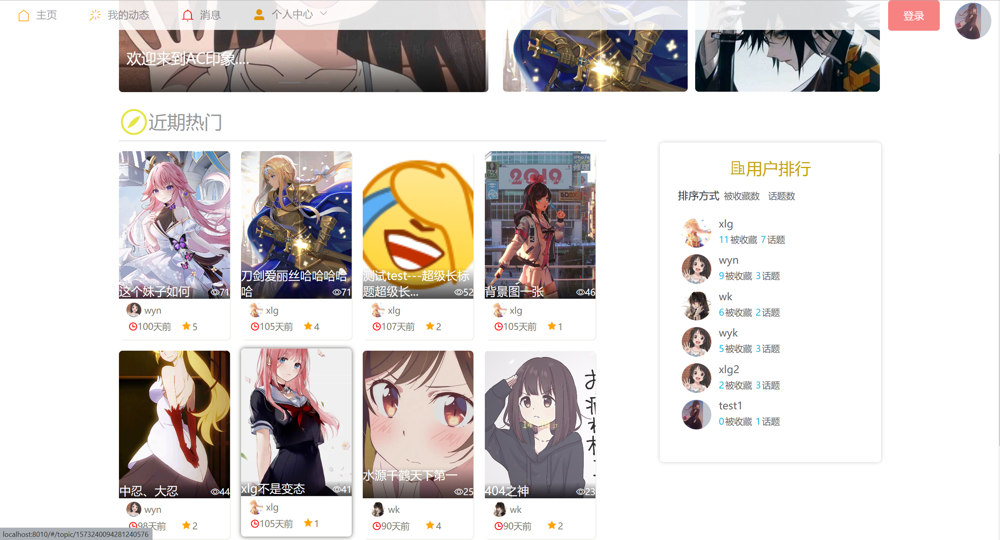            
             
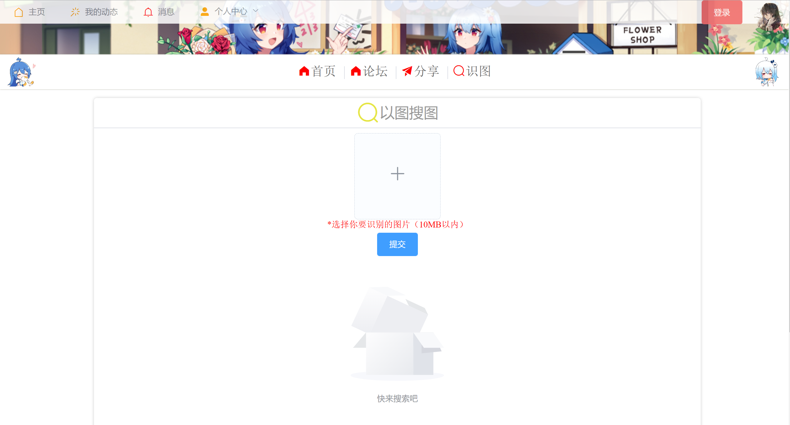           
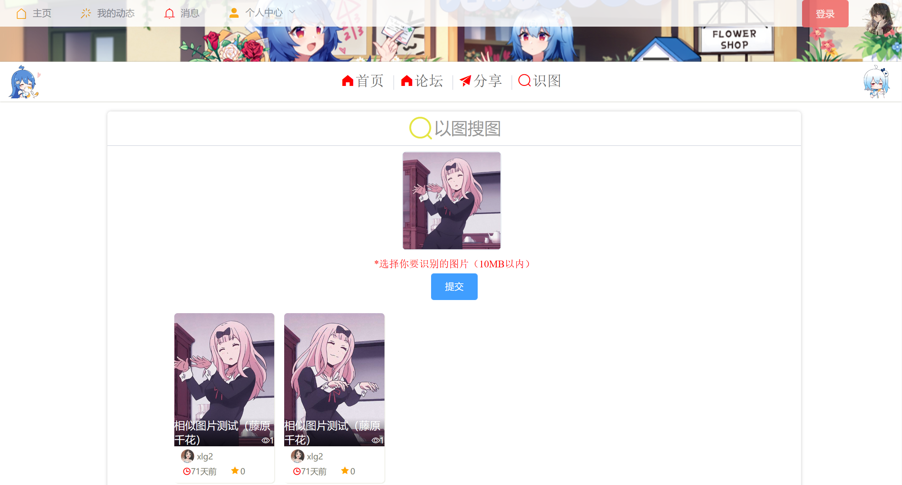              
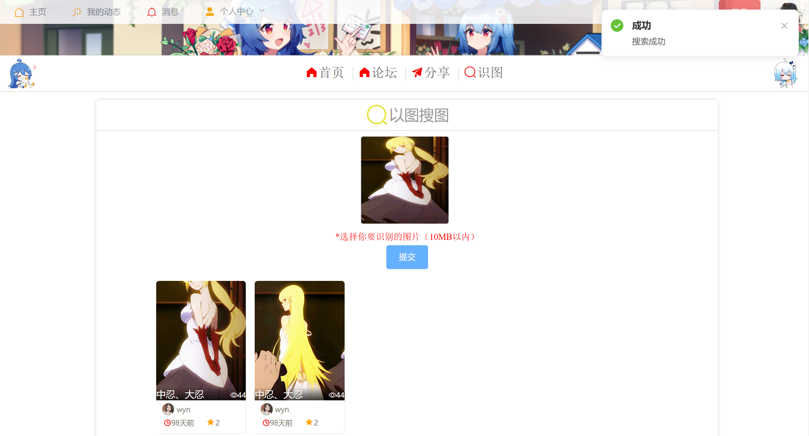               
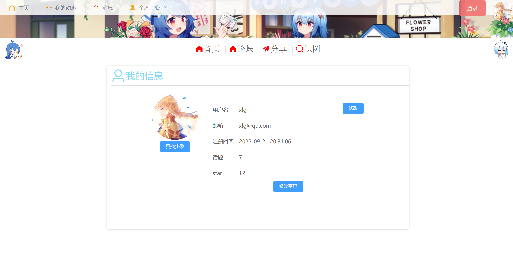          
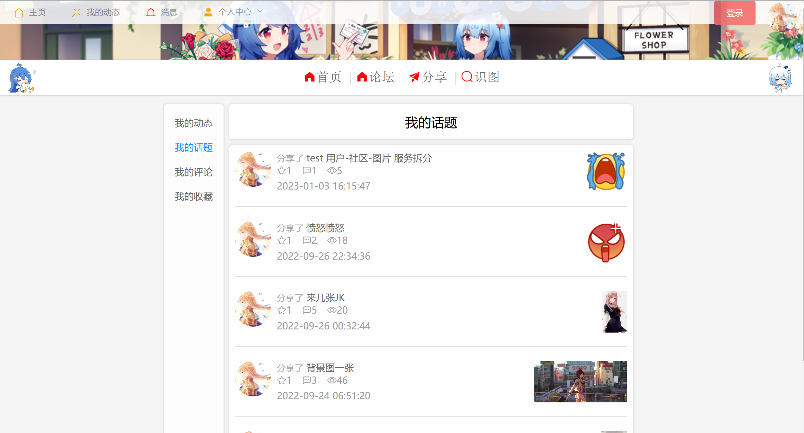               
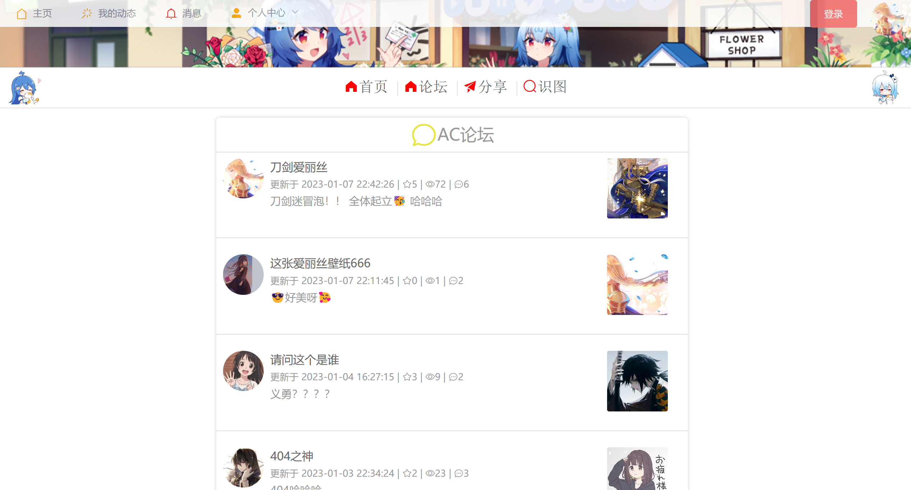        
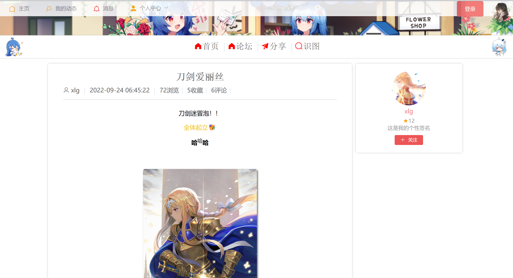               
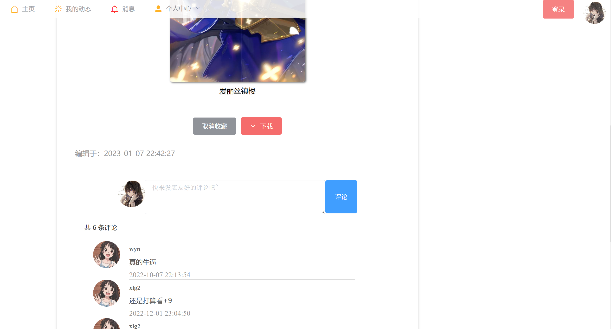        
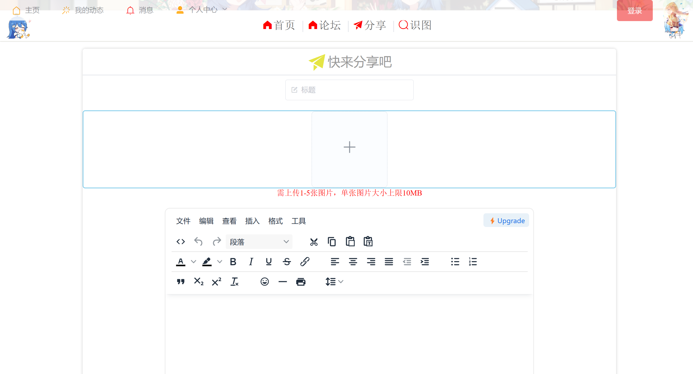               

`Admin端 只完成了 首页轮播图片管理，暂时不放出来`  

## 开源协议

[Apache License 2.0](https://www.apache.org/licenses/LICENSE-2.0.html)
