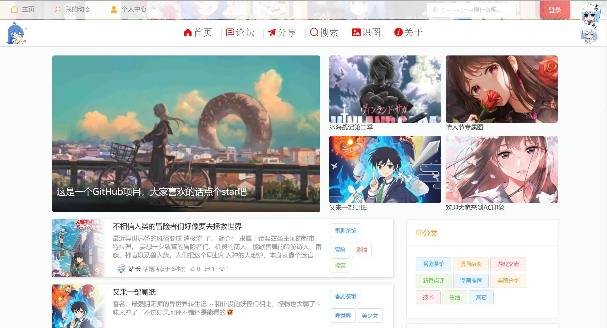

# 次元印象

</img>

次元印象，一个SpringCloud构建的动漫交流论坛

</img>
</img>
</img>
</img>
</img>
</img>

## 

## 前言

传说Github上的中国程序员有一半是二次元，于是~~为了吸引更多star，作为二次元（社死）的~~我边学习SpringCloud技术边开发了这个动漫交流论坛。

</img>

## 项目介绍

**次元印象** ( **acimage**) 是一个**基于SpringCloud**构建的**前后端分离**的动漫交流论坛。后端使用 **SpringCloud**+**Mybatis-Plus**+**Reids**+**Rabbitmq**+**Elasticsearch**。前端使用 **Vue** + **ElementUi** + **Vite** 。项目已经上线。各位Github的二次元们，还不来点个star(๑•̀ㅂ•́)و✧。

## 网址

**次元印象o(*≧▽≦)ツ~动漫交流论坛** www.acimage.top （只适配网页端，如果画面显小，可以适当放大浏览器，视觉效果更佳）。

**首页**

</img>

</img>

**论坛页**

</img>

</img>

</img>

## 系统架构

</img>

## 项目功能

#### 用户前台

- **以图识图**，即上传图片，识别出论坛内相似图片及其所在话题。
- **多样化搜索**，可以同时根据关键词、分类、标签以及排序字段等搜索，并根据关键词高亮匹配文字。
- **相关话题推荐**，**随机推荐**。
- **话题排行榜**（按star、浏览量、评论数等、活跃时间排行）。
- **用户排行榜**（按话题数、star等排行）。
- 分类、标签，并且点击可筛选出符合相关分类或标签的话题。
- **实时展示最新活跃话题**。
- **敏感词过滤**，**图片压缩**。
- 查看个人动态、修改个人信息。
- 登录、注册、登出，**验证码防刷**，**邮箱验证**。
- 发表话题，评论，star等。

#### 后台管理

- 较为完善的RBAC权限控制，可动态调整用户角色、角色权限、接口权限等。
- 网站基本数据展示，访客量，接口调用数等。
- 首页轮播图片管理。
- 话题、评论管理。

## 项目特点

- **JWT**实现单点登录，网关统一身份认证和鉴权，完善的**RBAC**权限控制。
- 利用**Redis+Lua脚本+定时任务**对变动比较频繁的数据（浏览量等）定时持久化。
- 利用**Redis+Lua脚本+自定义注解**，只需一个注解就可以实现针对ip、用户、和总体请求量的限流。
- 利用**Dhash**算法实现以图识图功能，效果还可以。
- 上传的图片均用webp压缩，极大地减少带宽压力。

## 项目目录

**后端服务**

- **acimage_gateway**：网关，统一身份认证、鉴权，分别针对用户和总体请求量的限流
- **acimage_user**：用户中心，用户注册、登录，邮箱服务等
- **acimage_community**：社区服务，负责论坛话题相关的核心功能
- **acimage_image**：图片服务，负责话题图片上传、头像上传、以图识图等功能
- **acimage_admin**: 管理服务

**后端模块**

- **acimage_common**：公共模块，存放实体类、公共的拦截器、公共配置以及公共工具类等
- **acimage_feign**：放置各个模块的feign客户端

**前端**

- **vue_manage_system**：后台管理页面
- **vue_acimage_web**：门户网站页面

**其它**

- **doc**: 一些文档、图片和数据库文件

## 运行与部署

**目前项目仍在不断完善，运行与部署流程以后再更新**。

- ~~将**doc/sql** 下的三个数据库分别导入到**mysql**中，四个数据库分别是四个前台服务对应的数据库~~

- ~~在每个服务的**application-dev.yml**文件中配置**mysql、redis、rabbitmq**、**nacos**相应的地址或账号密码~~

- ~~填写**acimage_common**中的**application-qiniu-template.yml**中的七牛云账号信息，包括**access-key**、**secret-key**、**domian**、**bucket**，或者给这四个属性随便赋值（不能为空，否则**NPE**），但是这样无法使用上传图片。并将**application-qiniu-template.yml**重命名为**application-qiniu.yml**~~

- ~~在**acimage_common**模块的下的**application.yml**配置 **nacos** 地址、**sentinel**地址（**sentinel**不配也不影响运行）~~

- ~~启动**nacos、redis、rabbitmq、mysql**~~

- ~~依次启动**acimage_user**、**acimage_community**、**acimage_image**、**acimage_gateway**，不这样启动的话可能会由于**rabbitmq**队列创建和绑定顺序的问题报错，如果遇到了，则全部服务再重新启动一遍。~~

- ~~运行前端（具体看**vue_acimage_web**的**README**）后点击默认弹出的链接即可访问首页~~

- ~~前台登录**：用户：wk，密码：wk123456 
  （还有几个用户可以从数据库sql文件看到，密码均为  用户名123456）~~

- 端口：
  
  - **acimage_user**: 8100  
  
  - **acimage_image** : 8090 
  
  - **acimage_community**: 8080
  
  - **acimage_gateway**: 8070

## 技术选型

#### 后端技术栈

**SpringBoot**、**SpringCloud**、**MyBatis-plus**、**Druid**（数据库连接池）、**Redis**（分布式缓存）、**Rabbitmq**（消息队列）、**Elasticsearch**（分布式搜索引擎）、**Minio**（对象存储服务）、**Nginx**（反向代理服务器）、**Docker**（应用容器引擎）

#### 用户界面前端

**Vue2**、**Vue Router**（路由）、**ElementUi**（Vue基础组件库）、**axios**（http客户端）、**jsencrypt**（基于RSA加解密的js库）、**vue-dompurify-html**（防xss攻击）、**tinymce-vue**（富文本编辑器）

#### 后台管理界面前端

**Vite**、**TypeSript**

## Todo

- [x] 分类、标签
- [x] 话题、用户排行榜
- [x] 随机推荐
- [x] 相似话题推荐
- [x] 敏感词过滤
- [x] 接口幂等
- [x] 细化限流
- [x] 完善RABC权限控制，网关统一身份认证及鉴权
- [x] 增加邮件服务，邮箱验证，验证码等
- [x] 将图片存储在minio（原来存储在七牛云）
- [x] elasticsearch多样化搜索，关键词高亮
- [ ] 利用redis+lua批量提取缓存中话题和浏览量等，减少通信次数，实时展示数据。
- [ ] 增加评论表情
- [ ] 增加用户消息通知功能
- [ ] 增加关注功能
- [ ] 完善sentinel和nacos等配置和使用
- [ ] 增加爬虫模块
- [ ] 完善单元测试
- [ ] 等等等

## 交流

项目起初是为了学习技术搭建的，由于能力有限，还有很多不完善的地方，欢迎各位能够指正。如果有人感兴趣（多么希望真的有人感兴趣 手动捂脸）或者该项目遇到什么问题或有什么建议提issue，可联系邮箱1179836161@qq.com或进群692992463交流。喜欢的话记得点个star。

## 网站截图

 **Web端** 
             
  
             
  
 
 
 
 
 
  
  
 
              

 **Admin端**  
 管理系统随便放几张吧，反正管理系统都长一个样。
  
  

## 开源协议

[Apache License 2.0](https://www.apache.org/licenses/LICENSE-2.0.html)
